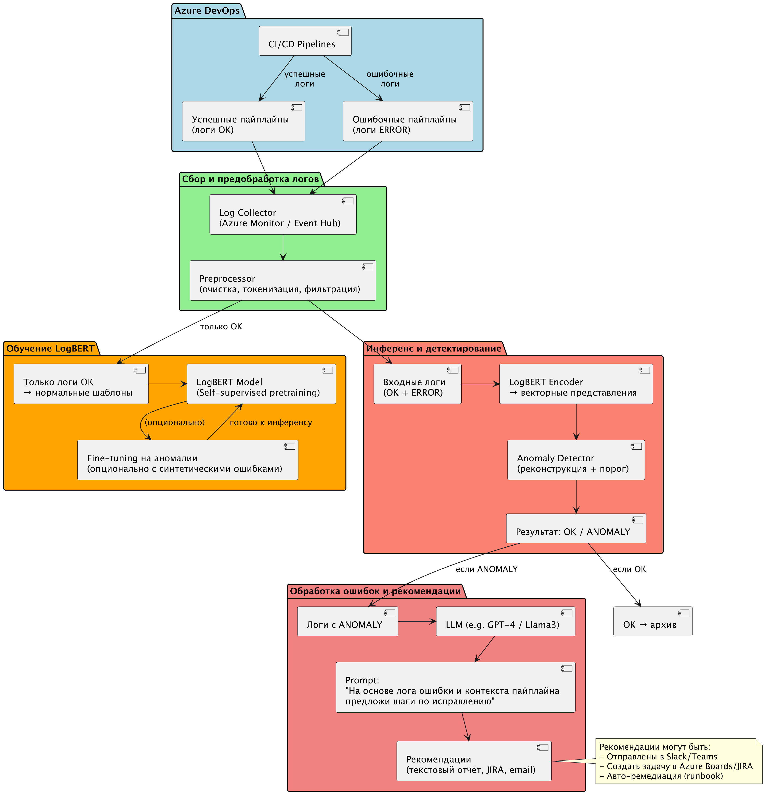

# Proof of Concept системы автоматического разбора ошибок исполнения в информационных системах.

Задача обработки логов решается как с целью мониторига, так и в качестве источника информации при решении проблем. Традиционно применяются алгоритмические подходы, поиск по паттернам, формирование алертов и прочие полуавтоматичские способы. И в любом таком случае решения поностью зависит и от источника данных, и от их формата, и от их характера, так как решение строится по заранее созданным формальным правилам. Но существует и иной способ, в стиле Software 2.0 , это когда нет необходимости в процессе решения отвечать на вопрос "как сделать" и расписывать процедуру, а лишь понимать "что сделано верно" и уметь отличать результат от неверного. Иначе говоря, использование технологии нейросетей позволяет отвязать процесс исследования логов от трудоемкой формализации и заменить её проверкой качества результата.

Однако, идея обработки логов с целью поиска аномалий и дальнейшего формирования рекомендаций или обработки ошибок с помощью агентов или иных средств автоматизации не принадлежит к числу гениальных догадок.

Анализ логов (log analysis) — это ключевой аспект мониторинга систем, где используются модели машинного обучения для задач вроде парсинга логов, обнаружения аномалий и прогнозирования сбоев. В сети легко находятся три популярных подхода: **DeepLog** (2017), **LogBERT** (2021) и **LogGPT** (2023).

И приступая к собственной разработке просто необходимо рассмотреть уже существующие решения.

## Анализ существующих подходов.

Рассмотрим в порядке упоминания:

### DeepLog

1. Архитектура LSTM (Long Short-Term Memory) сети для моделирования последовательностей логов. Логи парсятся в шаблоны (event templates), затем строится модель марковских цепей + LSTM для прогнозирования.

2. Метод обучения несупервизированный (unsupervised): обучается на нормальных логах для выявления отклонений. Использует workflow для кластеризации шаблонов.

3. Ключевые задачи:
- Обнаружение аномалий в последовательностях.
- Прогнозирование следующего события в логе.

4. Преимущества:
- Эффективен для длинных последовательностей (LSTM хорошо захватывает временные зависимости).
- Низкие требования к ресурсам.
- Хорош для реального времени в production-системах.

5. Ограничения:
- Требует предварительного парсинга логов (Drain или аналог).
- Слаб в обработке неструктурированных/шумных данных.
- Не масштабируется на очень большие датасеты без доработок. 

6. Применение - Классические системы мониторинга (Hadoop, Supercomputer logs).

7. Производительность (пример на HDFS-бенчмарке) - F1 для аномалий: ~92%.

### LogBERT

1. Архитектура BERT (Bidirectional Encoder Representations from Transformers) с дообучением на логах. Использует self-supervised обучение для извлечения представлений из сырых логов.

2. Метод обучения само-супервизированный (self-supervised): маскирует части логов и предсказывает их. Затем fine-tuning для downstream-задач.

3. Ключевые задачи:
- Парсинг логов (извлечение шаблонов).
- Обнаружение аномалий.
- Классификация событий.

4. Преимущества:
- Учитывает контекст bidirectional (вперед/назад), лучше для сложных шаблонов.
- Высокая точность парсинга (F1-score > 95% на бенчмарках).
- Адаптируется к разным доменам логов.

5. Ограничения:
- Высокие вычислительные затраты (BERT требует GPU).
- Меньше фокуса на генерации/объяснениях.
- Зависит от качества дообучения.

6. Применение - Современные облачные платформы (Kubernetes logs).

7. Производительность (пример на HDFS-бенчмарке) - F1 для аномалий: ~96%.


### LogGPT

1. Архитектура GPT-подобные LLM (например, ChatGPT или Llama) с fine-tuning или prompt engineering. Фокус на генеративных возможностях для обработки неструктурированных текстов.

2. Метод обучения полу-супервизированный или zero-shot: использует промпты для парсинга/анализа без большого fine-tuning. Может комбинироваться с few-shot learning.

3. Ключевые задачи:
- Парсинг и суммаризация логов.
- Обнаружение аномалий via natural language inference.
- Генерация объяснений сбоев.

4. Преимущества:
- Гибкость: работает с сырыми текстами без парсинга.
- Zero/few-shot: быстро адаптируется к новым логам via промпты.
- Генерирует интерпретируемые выводы (например, "почему аномалия?").

5. Ограничения:
- Зависит от качества промптов (hallucinations возможны).
- Дорого в inference (LLM ресурсоемкие).
- Менее точен в строгих последовательностях без fine-tuning.

6. Применение - Интеграция с LLM для DevOps (например, в CI/CD пайплайнах).

7. Производительность (пример на HDFS-бенчмарке) - F1 для аномалий: ~94% (zero-shot), до 97% с fine-tuning.

### Выводы.

Если кратко:
- **DeepLog** — надежный baseline для unsupervised anomaly detection, идеален для legacy-систем с ограниченными ресурсами.
- **LogBERT** — шаг вперед в точности за счет трансформеров, но требует больше усилий на подготовку.
- **LogGPT** — самый инновационный и гибкий, особенно для интерпретируемого анализа, но страдает от overhead LLM.

И в итоге выбор LogBERT и далее аргументы в пользу этого решения:
- Архитектура LogBERT идеально подходит для детектирования аномалий, позволяет решить это с помощью относительно маленькой модели и после квантизации такую модель можно запускать даже на CPU.
- Все варианты так или иначе предусматривают использование Drain3 обработчика логов, и потому этот фактор нигде не дает преимуществ, однако позволяет сделать интересный вывод. Так как детектирующая модель на входе имеет не оригинальные логи и Drain3 события, то в любом случае для формирование так называемых интерпретируемых выводов понадобится обратное преобразование найденных аномалий в строки лога, а значит выполнить генерацию человеко-читаемого ответа непосредственно в процессе детектирования аномалий не получится. Тогда в чем смысл декодерной модели GPT в этом случае?
- Обучение модели BERT скорее всего будет дешевле такой же модели GPT, и даже более можно сказать, что в случае в BERT будет возможно произвести не файн-тюнинг, а полноценное обучение на доменно-специфичных логах.
- Возможность реализации self-supervised обучения, а именно обучение на датасетах без разметки или с минимальной разметкой, во-первых, и далее эффективное дообучение на доменно-близких или полностью подобных данных, во вторых.

## Выбор источника данных.

Под условия задачи попадают практически все возможные логи, создаваемые в процессе работы вычислительных систем. Однако, процесс обучения предполагается вести на логах, сопровождающих успешный период работы, для того чтобы можно было с помощью обученной модели LogBERT выявить признаки надвигающейся или уже случившейся проблемы. Для этого набо быть точно убежденным, что взятые для обучения логи соответствуют успешному функционированию обозреваемой системы.

Вот это необходимое условие сильно сужает, или точнее сказать создает дополнительную трудность для выделения нужного объема логов без применения сложной алгоритмической или даже ручной разметки. Нельзя просто взять системные логи сервера, который работал без остановки пару лет, а потом сломался, и использовать для обучения некую их часть, чтобы уверенно и успешно таким образом предположить, что другой части обученная модель найдет аномальные признаки, которые в конце концов объяснят отказ.

Если развить тему с сервером, но нужно иметь достаточно весомую выборку из успешных периодов работы подобной системы, чтобы обучить с их помощью модель, которая потом сможит мониторить аналогичный сервер и указывать на возникающие проблемы.

Еще лучше, если назначение обозреваемой системы заключается в выполнении некой задачи, по результату которой можно определить успешность функционирования. Да, это можно и для того самого сервера определить, как работа в заданных режимах, но тогда остается вопрос о полноте измерений параметров тех самых режимов. А вот если в результате появляется четко оцениваемый результат, или напротив не появляется, то все сомнения пропадают.

И тут как "рояль в кустах", и совершенно "случайно" обнаруживается источник именно таких данных. И это логи выполнения пайплайнов CI/CD:
- Задачи требующие совершенно конкретного и конечного времени исполнения.
- Многократно повторяющиеся и работающие над схожими данными.
- Логи сохраняются самой системой.
- Успех или неудача исполнения определяется самой системой. 

## Дизайн системы.

Предполагаемый дизайн системы представлен на скетче Рисунок 1.

Рисуной 1

Двигаясь по блокам сверху вниз:
- синий-зеленый-оранжевый обозначают поток обучения, получение логов, предварительная обработка, препроцессор Drain3, и обучение LogBERT модели.
- синий-зеленый-красный показывают поток инференса на обученной модели.
- красный-малиновый показывает обработку результата поиска аномалий в логах ошибочного исполнения так, чтобы сформировать человеко-читаемый результат

## Прототип ожидаемого результата.

В полном соответствии с объявленной в самом начале парадигмой Software 2.0 опишем ожидаемый результат на примере обработки реального протокола ошибочного исполнения. То как предположительно должен формироваться тот самый человеко-читаемый результат, причем на примере совершенно реального лога.

### Промпт.

Как можно понять и исправить ошибку исполнения пайплайны
```
2025-11-05T13:29:27.4173559Z ##[error]Bash exited with code '1'.
```
на основании двух фрагментов строк лога, которые выделены как аномальные
```
2025-11-05T13:26:56.7933065Z version --- 1.1.199
2025-11-05T13:26:56.7933636Z --- request repository.example.com/app/service01:1.1.199
2025-11-05T13:26:57.6903718Z failed to request manifest head repository.example.com/app/service01:1.1.199: request failed: not found [http 404]:
2025-11-05T13:26:57.6981252Z --- request repository.example.com/app/service02:1.1.199
2025-11-05T13:26:58.7290692Z failed to request manifest head repository.example.com/app/service02:1.1.199: request failed: not found [http 404]:
2025-11-05T13:26:58.7375773Z --- request repository.example.com/app/service03:1.1.199
2025-11-05T13:27:01.2689950Z failed to request manifest head repository.example.com/app/service03:1.1.199: request failed: not found [http 404]:
2025-11-05T13:27:01.2763224Z --- request repository.example.com/app/service04:1.1.199
2025-11-05T13:27:02.6031011Z failed to request manifest head repository.example.com/app/service04:1.1.199: request failed: not found [http 404]:
2025-11-05T13:27:02.6122140Z --- request repository.example.com/app/service05:1.1.199
2025-11-05T13:27:03.6624155Z failed to request manifest head repository.example.com/app/service05:1.1.199: request failed: not found [http 404]:
2025-11-05T13:27:16.3569470Z --- request repository.example.com/app/service06:1.1.199
2025-11-05T13:27:17.4437560Z failed to request manifest head repository.example.com/app/service06:1.1.199: request failed: not found [http 404]:
```
и
```
2025-11-05T13:29:27.4034844Z Failed to copy image repository.example.com/app/service06@sha256:2846b39b810bec039ce827239473dd8ca24ed457a3812d7c59eca137883a052b: 1 error occurred:
2025-11-05T13:29:27.4038551Z    * failed to fixup the image repository.example.com/app/service06@sha256:2846b39b810bec039ce827239473dd8ca24ed457a3812d7c59eca137883a052b for service "service06": failed to resolve image repository.example.com/app/service06@sha256:2846b39b810bec039ce827239473dd8ca24ed457a3812d7c59eca137883a052b: repository.example.com/app/service06@sha256:2846b39b810bec039ce827239473dd8ca24ed457a3812d7c59eca137883a052b: not found
2025-11-05T13:29:27.4040663Z
2025-11-05T13:29:27.4040819Z
2025-11-05T13:29:27.4041395Z error preparing the bundle with cnab-to-oci before pushing: 1 error occurred:
2025-11-05T13:29:27.4043644Z    * failed to fixup the image repository.example.com/app/service06@sha256:2846b39b810bec039ce827239473dd8ca24ed457a3812d7c59eca137883a052b for service "service06": failed to resolve image repository.example.com/app/service06@sha256:2846b39b810bec039ce827239473dd8ca24ed457a3812d7c59eca137883a052b: repository.example.com/app/service06@sha256:2846b39b810bec039ce827239473dd8ca24ed457a3812d7c59eca137883a052b: not found
2025-11-05T13:29:27.4045279Z
2025-11-05T13:29:27.4045454Z
2025-11-05T13:29:27.4045995Z error preparing the bundle with cnab-to-oci before pushing: 1 error occurred:
2025-11-05T13:29:27.4047867Z    * failed to fixup the image repository.example.com/app/service06@sha256:2846b39b810bec039ce827239473dd8ca24ed457a3812d7c59eca137883a052b for service "service06": failed to resolve image repository.example.com/app/service06@sha256:2846b39b810bec039ce827239473dd8ca24ed457a3812d7c59eca137883a052b: repository.example.com/app/service06@sha256:2846b39b810bec039ce827239473dd8ca24ed457a3812d7c59eca137883a052b: not found
```

### Ответ от локальной LLM Qwen-like

Ошибка `##[error]Bash exited with code '1'` означает, что **выполняемый скрипт (или команда) завершился с кодом ошибки 1**, то есть произошла ошибка выполнения.

Из предоставленных логов можно сделать следующие выводы:

---

#### 🔍 Основная проблема:
Все строки вида:
```
failed to request manifest head ...: request failed: not found [http 404]
```
говорят о том, что система пытается получить образ Docker по адресу:
```
repository.example.com/app/<service>:1.1.199
```
но не находит его — **возвращается HTTP 404**.

А потом, когда уже пытается использовать этот образ (по SHA256), также получает ошибку:
```
repository.example.com/app/service06@sha256:...: not found
```

---

#### 🧠 Возможные причины:
1. **Образы не были загружены в реестр**
   - Возможно, они не были собраны и pushed в `repository.example.com/app/` перед запуском пайплайна.
2. **Неверная версия тега**
   - Тег `1.1.199` отсутствует в реестре.
3. **Ошибка в конфигурации пайплайна**
   - Возможно, в файле `.yaml` или скрипте указан неправильный тег или имя образа.
4. **Проблемы с доступом к реестру**
   - Не хватает прав или нет авторизации для доступа к `repository.example.com`.

---

#### ✅ Что делать:

##### 1. Проверь наличие образов в реестре
Зайди в реестр `repository.example.com` и проверь, есть ли там теги:
```
app/service01:1.1.199
app/service02:1.1.199
...
app/service06:1.1.199
```

Если их нет — значит нужно собрать и загрузить образы.

##### 2. Убедись, что сборка прошла успешно
Проверь предыдущие шаги пайплайна, где собирались и пушались образы. Нужно убедиться, что они действительно были загружены.

Пример команды для проверки:
```bash
docker pull repository.example.com/app/service01:1.1.199
```

Если команда завершится с ошибкой — значит образа нет.

##### 3. Проверь теги и пути
Убедись, что в `.yaml`, `Dockerfile`, `docker-compose.yml` или других файлах используется правильный тег (`1.1.199`) и путь к образу.

##### 4. Проверь права доступа к реестру
Если используется CI/CD система (например, GitHub Actions, GitLab CI), убедись, что:
- Токен/логин/пароль корректны.
- Сервис имеет право читать из реестра.

##### 5. Используй конкретный SHA256, если нужно
Если ты хочешь использовать конкретную версию образа, лучше указывать его по `digest` вместо тега, чтобы исключить случайное изменение тега.

Пример:
```yaml
image: repository.example.com/app/service06@sha256:2846b39b810bec039ce827239473dd8ca24ed457a3812d7c59eca137883a052b
```

Но только если такой digest действительно существует в реестре.

---

#### 🛠 Рекомендации по исправлению

1. **Сборка и пуш образов должна происходить до использования**.
2. **Добавь логирование при сборке и пушинге**, чтобы видеть, какие именно образы создаются.
3. **Используй проверку наличия образов перед запуском**:
   ```bash
   docker pull repository.example.com/app/service01:1.1.199 || exit 1
   ```
4. **Если используешь CNAB или Helm**, убедись, что все зависимости подтягиваются корректно.

---

#### 💡 Пример фикса в bash-скрипте:
```bash
#!/bin/bash

IMAGE_TAG="1.1.199"
REGISTRY="repository.example.com/iam"

SERVICES=(
    service01
    service02
    service03
    service04
    service05
    service06
)

for svc in "${SERVICES[@]}"; do
    echo "Checking image: $REGISTRY/$svc:$IMAGE_TAG"
    if ! docker pull "$REGISTRY/$svc:$IMAGE_TAG"; then
        echo "Failed to pull image: $REGISTRY/$svc:$IMAGE_TAG"
        exit 1
    fi
done

echo "All images pulled successfully."
```

---

#### 📌 Вывод:
Ошибка возникает потому, что **образы не найдены в реестре**. Чтобы исправить:
- Убедись, что образы собраны и загружены в реестр.
- Проверь, что теги совпадают.
- Добавь проверку на существование образов перед использованием.

Если нужна помощь с конкретным шагом пайплайна — пришли его часть (например, `yaml` или `bash`).

### Ответ от мощной облачной LLM KIMI

Причина «Bash exited with code '1'» – не сама bash, а то, что запускаемый в пайплайне инструмент (похоже, cnab-to-oci или docker/crane) вернул exit 1, потому что не смог найти нужные образы.  
В логе две группы одинаковых 404-ошибок:

1. «failed to request manifest head …: not found» – образа с тегом 1.1.199 в реестре нет.
2. «failed to resolve image …@sha256:2846b… not found» – cnab-to-oci пытается скачать конкретный манифест по дайджесту, но и его нет.

Иными словами, сборка пытается упаковать CNAB-бандл, в котором прописаны шесть сервисов, но ни одного из этих образов в registry.example.com при загрузке пайплайна не оказалось. Поэтому шаг «copy/fixup» падает и возвращает 1, что и фиксирует Azure DevOps.

Как понять, где именно пропущен образ:

- Версия, которую ищет скрипт, – 1.1.199 (видно в первой строке лога).  
- В реестре лежат, например, 1.1.198 или 1.1.200, а 1.1.199 никто не пушил.  
- Либо образы service01..service06 собираются в параллельном джобе, который ещё не успел закончиться/запушить, либо вовсе не собираются из-за предыдущего падения.  
- Либо тег формируется динамически (semver, counter), но в этот прогон попало промежуточное значение.

Что сделать, чтобы исправить:

1. Убедиться, что перед шагом «cnab-to-oci push» для всех шести сервисов действительно выполняется docker build + docker push с тегом 1.1.199.  
   - Если образы строятся в upstream-job’ах – поставить нужный order/dependsOn, чтобы job с bundling ждал их окончания.  
   - Если тег берётся из переменной $(Build.BuildId) или счётчика – проверить, что эта же переменная используется и при сборке, и при упаковке.

2. Проверить, не указан ли в Dockerfile/docker-compose.yml фиксированный digest, который уже удалён (GC) или перезаписан. Лучше ориентироваться на тег и пересобирать образы при каждом релизе.

3. Добавить в пайплайн явный шаг проверки:

```bash
# пример для crane (google/go-containerregistry)
crane manifest repository.example.com/app/service01:1.1.199 \
  || (echo "service01:1.1.199 still absent" && exit 1)
```
и запускать его перед cnab-to-oci. Тогда падение будет понятным сразу, а не после 2-минутных попыток fixup.

4. Если 1.1.199 случайно «промежуточный» тег, а нужны только «latest» или «stable», убрать жёсткую привязку к 1.1.199 и использовать floating-теги либо шаблон `$(image):$(Build.SourceBranchName)`.

5. Убедиться, что registry.example.com доступен из агента и у сервис-коннекта/патена есть права на pull (иначе 404 маскирует 403).

После того как все шесть образов появятся в реестре под нужным тегом (или вы поправите шаблон тега), шаг copy/fixup пройдёт успешно, exit code станет 0 и «Bash exited with code '1'» исчезнет.

### Оценка качества.

На этом примере очень заметна разница в качестве ответа. Второй ответ на порядок лучше:
- LLM определил связь факта отсутствия образа в репозитории и входных параметров пайплайны.
- правильно описал процесс как сборку CNAB.
- не распылялся по множеству предположений.

И тут очень важно отметить, что никакая предобученная локальная LLM не даст такого же качественного ответа со столь полным анализом, и никакой даже самый сильный бюджет не позволит отправлять в облачный проприетарный сервис логи для тюнинга или контекстного RAG даже после Drain3 очистки. И таким образом подтверждается правильность использования связки Drain3-LogBERT для уменьшения контекста запроса и снижения таким путем стоимости работы всей системы.

