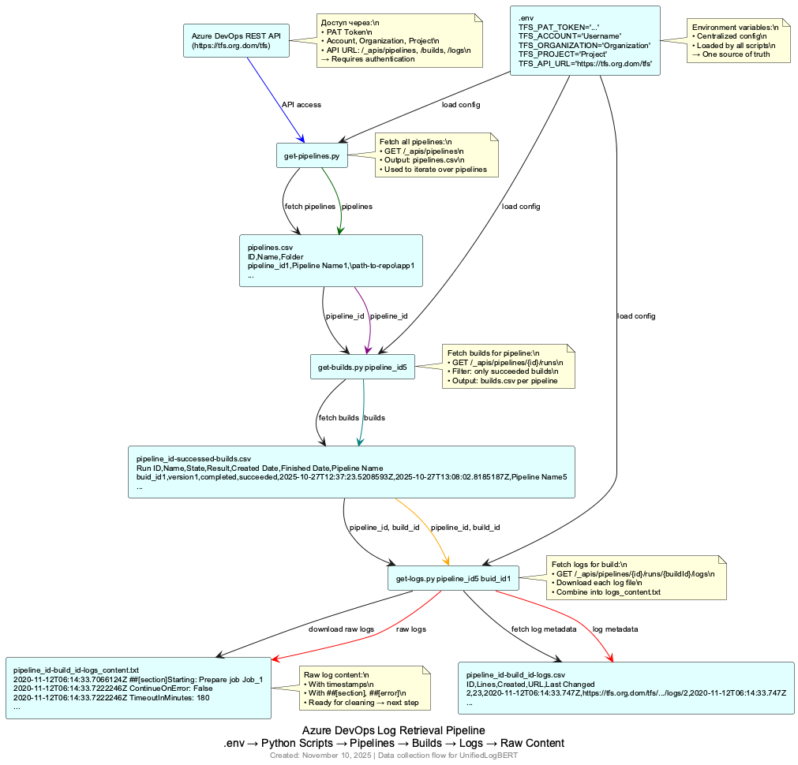
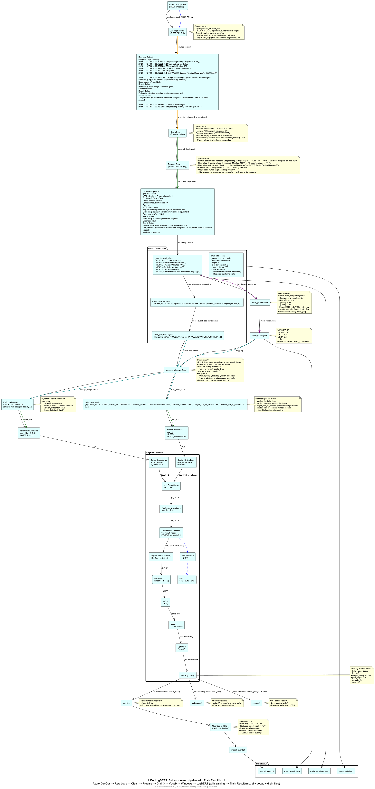
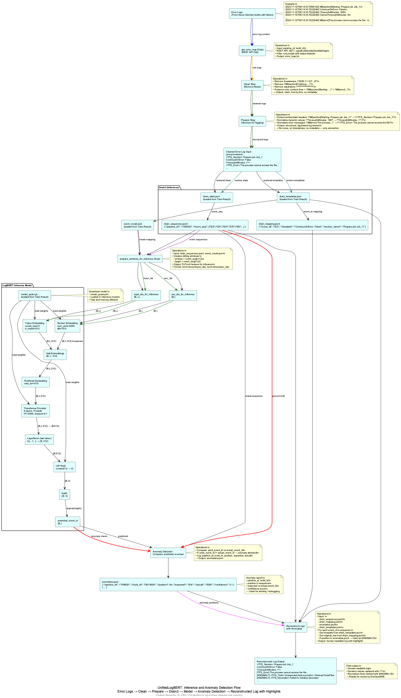

# Дизайн-проект разработки.

Данный проект представляет собой Proof-Of-Concept, то есть демонстрацию практической осуществимости подобной реализации, но не продуманную в деталях товарную систему. Поэтому код разбит на ряд скриптов, которые служат не созданию удобного для использования продукта, а лишь только реализуют части его без цели общей интеграции. Весь код пишется на Python и испольняется в виртуальном окружении. Общий функционал вынесен в модули, размещенные в папке `modiles`. Все настройки, кастомизирующие работу скриптов, собраны в один конфигурационный файл `config.yaml`. Скрипты внутри максимально прокомментированы и снабжены подсказками к применению.

Для удобства указания очередности применния скриптов их имена снбжены норным префиксом, который задает правильный порядок сортировки, в соответсвии с очередностью вызовов.

**Disclaimer:**
- Внутри скриптов есть не использованные, и значит, не отлаженные ветки исполнения. Например, взаимодействие с MLFlow сейчас просто отключено.
- Внутри виртуального окружения есть конфликты, которые к сожалению устраняются только ручным способом. Например, пакеты для работы с MLFlow конфликтуют с Drain3. Но специальное исследование на эту тему доказало, что эту проблему можно игнорировать.

Далее рассмотрим дизайн по задачам, реализованным и не только.

## Получение логов Azure DevOps

Процесс получения логов схематически изображен на скетче Рисунок 2.

Рисунок 2

Схема показывает цепочку взаимодействующих скриптов, которые последовательно извлекают данные и передают от скрипта к скрипту, извлекая список пайплайнов, затем список билдов/исполнений, и в конце-концов список логов и сами логи в том виде как их формирует система.

Детали описаны в [ADR-001: Архитектура флоу получения логов из Azure DevOps](adr/adr-001-azure-devops-log-retrieval-architecture.md)

## Обучение модели LogBERT.

Данный этап объединяет весь процесс обучения модели и подготовки её к целевому инференсу. Флоу представлено на скетче Рисунок 3.

Рисунок 3

Первые три блока фактически повторяют предыдущий скетч но в условном варианте, чтобы не терять контекст. А вот все дальнейшее объединение сделано на том основании, что здесь представлен ряд общих задач, которые и могут, и как правило и решаются вне связи с источником данных, на том оборудовании, что максимально подходит для них. Это должна быть высокопроизводительная CPU система, так как Drain3 весьма требовательный к компьюту процесс, одновременно и достаточно оснащенная GPU система, так как на CPU обучать даже такую малышку как LogBERT очень затратно по времени.

И к этому скетчу тоже привязаны архитектурные решения, и их много:

- [ADR-002: Предобработка логов — Clean → Prepare](adr/adr-002-clean-prepare-log-preprocessing.md)

- [ADR-003: Формат данных — `event_id` последовательности + `section_bucket`](adr/adr-003-event-id-and-section-bucket-format.md)

- [ADR-004: Использование Drain3 для нормализации логов](adr/adr-004-use-drain3-for-log-normalization.md)

- [ADR-005: Использование event_vocab.json как единый источник истины](adr/adr-005-event-vocab.md)

- [ADR-006: Использование sliding window для обучения и инференса](adr/adr-006-sliding-window.md)

- [ADR-007: Архитектура модели — BERT-подобная с двумя эмбеддингами](adr/adr-007-unifiedlogbert-architecture.md)

- [ADR-008: Обучение на успешных логах, инференс на всех](adr/adr-008-train-on-success-logs.md)

- [ADR-009: Квантизация модели до INT8 для инференса](adr/adr-009-quantize-model-to-int8.md)

- [ADR-010: Хранение артефактов обучения в `Train Result`](adr/adr-010-train-result-artifact-packaging.md)

## Детектирование аномалий

Процесс подготовки данных для детектирования аномалий во многом повторяет действия по подготовке данных для обучения и использует данные артефакты, созданные на этапе обучения.

Схематически процесс детектирования аномалий изображен на скетче Рисунок 4.

Рисунок 4

Архитектурное решение, относящееся только к этому скетчу:

- [ADR-011: Восстановление логов с подсветкой аномалий](adr/adr-011-reconstruct-logs-with-anomalies.md)

