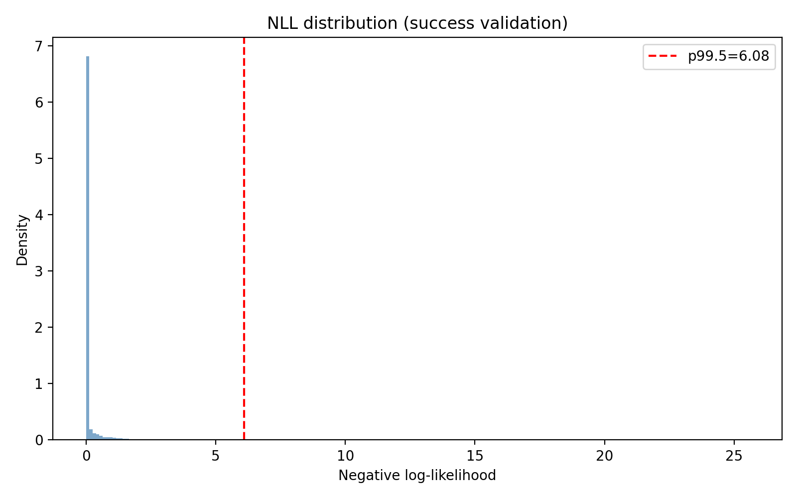

# Детектирования аномалий в логах.

После получения обученной модели следуя плану её следует квантизовать, и даже двумя способами. Однако, перед этим следует проверить, что модель работает как задумывалось. И после каждого преобразования проверить тоже. Иначе есть риск неожиданно потерять модель. Поэтому меняем порядок работ. С небольшой поправкой, что на данном этапе нужна только проверка детектора без полной обратной конвертации в логи.

Подготовим модель для классификации аномалий.

## Калибровка порога детектора.

После того как модель обучена необходимо определить порог срабатывания, тот уровень который позволит отделить успешные логи от аномальных. Для этого надо измерить распределение потерь (NLL) на нормальных (успешных) логах, чтобы определить, что считать “аномально высоким” отклонением.

Все действия исполняются скриптом `13-calibrate_threshold.py`.

Желаемый уровень указываем как `model.percentile` в конфигурационном файле, и затем в прогоне окон из набора валидации определяем `threshold_nll` при котором 99.5% данных определяются как норма.

Результат записывается в папку с моделью `model/checkpoints` в json файл:

```bash
❯ cat thresholds.json
{
  "percentile": 99.5,
  "threshold_nll": 6.084988117218018,
  "count": 497063
}
```

Это надо было сделать потому, что LogBERT не бинарный классификатор, а предсказатель вероятности «нормального» следующего события. И найденная граница позволяет решить эту проблему, и сформировать резолюцию норма или аномалия.

NLL (Negative Log Likelihood) отрицательное логарифмическое правдоподобе это тот же loss но без усреднения. Поэтому низкий NLL, близкий к достигнутому train_loss свидетельствует о том, что модель уверена в предсказании. Любое повышение снижает уверенность. И задав границу в 99.5% получили тот самый уровень NLL, который уже ни за что не позволяет "закрыть глаза" на такое событие.

Визуализация распределения NLL изображена на Диаграмме 1.

Диаграмма 1

Что же получилось в результате установления подобного порога. Не смотря на то, что он достаточно жесткий, допускается одно ложное срабатывание на 200 образцов! Если это не оценка возможной ядерной атаки или температуры активной зоны реактора, то миру ничего не угрожает, а пару лишних строк, следуя предполагаемому дизайну, сможет компенсировать обработка с помощью LLM на завершающем этапе.

## Тестовый инференс.

Тестовый потому что рабочий должен использовать квантизованную модель. Сейчас, как сказано выше, просто проверка правильности обучения, того что модель работает на примерах логов тех же пайплайнов, данные успешных исполнений которых использовались в обучении.

### Логика определения аномальных событий.

Инференс выполняется в том же окружении папок с данными, что и обучение. Для инференса на неквантизованной модели сразу после обучения используется скрипт `14-run_inference.py`. Общая схема процесса:

```
Файл логов → Drain3 → События → Окна → Батчи → Модель → Logits → NLL → Аномалии
```

Точно также как и для обучения логи очищаются и подготовливаются к Drain3 преобразованию в папке `dataset.prepared = "./dataset/prepared"` . Необходимый для преобразования индекс берется из уже созданного в `dataset.drain = "./dataset/drain"` , а именно файлы `drain_state.json` и `drain_templates.json` . Уже собранный словарь считывается из папки `dataset.vocab = dataset/vocab`, файл `event_vocab.json`.

Инференс и все преобразования происходят в папках указанных в соответствующем ключе:

```yaml
inference:
  drain_dir: "./inference/drain"
  scored_dir: "./inference/scored"
```

В папке `inference/drain` создаются точно такие же `drain_chunks.jsonl`, `drain_mapping.jsonl` и `drain_sequences.jsonl` как уже описано выше в разделе, посвященном обучению. Так как их генерация происходит на том же индексе Drain3, то и все выделенные события или соответствуют ранее построенному словарю или помечаются как `[UNK]`.

И далее все как в обучении формируются данные для инференса скользящим окном `size = 64`, упаковываются в батчи по `batch_size=256` и прогоняются через модель, взятую как `model/checkpoints/model.pt`и запущенную в режиме инференса как `torch.no_grad()`.

Для этого формируется входной тензор `input_ids` размера:
```
input_ids→(B,L)→(256,512)
```

Что означает загрузку на GPU матрицы из 256×512 токенов, и каждая из **256** строк этой матрицы представляет одно окно логов, а каждая строка имеет длину **512** токенов.

Модель `UnifiedLogBERT` имеет на входе эмбеддинг слой равный размерности модели 512 умноженной на размер словаря, полученного после Drain3. А на выходе линейный слой такого же размера. Первый кодирует токены в состояние трансформера, а последний преобразует состояния в логиты, которые распределяют оценки вероятности для каждого токена и затем расчитывается уже предсказания вероятности:

```python
logits = model(input_ids, sec_ids)  # (batch_size, vocab_size)
# logits.shape = (256, vocab_size)
# Вычисляем log probabilities для всех токенов в словаре
log_probs = F.log_softmax(logits, dim=-1)  # (batch_size, vocab_size)
# log_probs.shape = (256, vocab_size)
```

Таким образом предсказывается следующее событие после окна, в данном контексте токен, тот что был чуть выше кластером Drain3, а раньше частью строки или полной строкой в логе.

Окно сдвигается по батчу и так мы получаем оценки для набора токенов, который соответствуют строкам в логе. И каждый раз считаем NLL:

```python
# NLL для предсказания target-события
# log_probs[b, target_id] = log(вероятность что target_id - следующеесобытие)
# NLL = -log(вероятность) = отрицательный логарифм вероятности
nll = -log_probs[b, target_id].item()
```

Батчи могут перекрываться, события могу попадать в разные батчи и тогда NLL усредняется.

Далее все просто: если NLL превышает порог, рассчитанный выше как `"threshold_nll": 6.084988117218018` , то соответсующее событие считается аномальным.

### Визуализация полного цикла

```
┌─────────────────────────────────────────────────────────────┐
│ 1. build_windows()                                          │
│    events=[10,20,30,40,50] → окна:                          │
│      окно0: [10,20,30] target=40 (pos=3)                   │
│      окно1: [20,30,40] target=50 (pos=4)                   │
│      окно2: [30,40,50] target=None                         │
└─────────────────────────────────────────────────────────────┘
                            ↓
┌─────────────────────────────────────────────────────────────┐
│ 2. infer_nll_per_position() - разбиение на батчи            │
│    Всего окон: 1000, batch_size=256                         │
│    → Батч 0: окна [0:256]                                   │
│    → Батч 1: окна [256:512]                                │
│    → Батч 2: окна [512:768]                                 │
│    → Батч 3: окна [768:1000]                               │
└─────────────────────────────────────────────────────────────┘
                            ↓
┌─────────────────────────────────────────────────────────────┐
│ 3. Для каждого батча:                                       │
│    input_ids = (256, 32)  ← тензор окон                     │
│    sec_ids = (256,)      ← section_id для каждого окна     │
│                            ↓                                │
│    logits = model(input_ids, sec_ids)                      │
│    logits.shape = (256, vocab_size)                        │
│                            ↓                                │
│    log_probs = log_softmax(logits)                         │
│    log_probs.shape = (256, vocab_size)                     │
│                            ↓                                │
│    Для каждого окна b в батче:                             │
│      target_id = batch_target_ids[b]                       │
│      target_pos = batch_target_pos[b]                      │
│      nll = -log_probs[b, target_id]                        │
│      sums[target_pos] += nll                               │
│      counts[target_pos] += 1                               │
└─────────────────────────────────────────────────────────────┘
                            ↓
┌─────────────────────────────────────────────────────────────┐
│ 4. Усреднение: nll_per_pos[i] = sums[i] / counts[i]        │
│    Результат: список NLL для каждой позиции                 │
└─────────────────────────────────────────────────────────────┘
                            ↓
┌─────────────────────────────────────────────────────────────┐
│ 5. Детектирование аномалий:                                 │
│    is_anomaly = (nll > threshold) OR (cluster_id is None)   │
└─────────────────────────────────────────────────────────────┘
```

### Ключевые моменты

1. Окна создаются со слайдом 1, поэтому одна позиция может быть target в нескольких окнах.
2. Усреднение: если позиция `i` была target в `k` окнах, берется средний NLL.
3. Батчи: все окна разбиваются на батчи фиксированного размера для эффективной обработки на GPU.
4. Модель предсказывает следующее событие после окна, используя последнюю позицию окна.
5. NLL = `-log(вероятность)`: чем выше NLL, тем ниже вероятность и выше подозрение на аномалию.

Это соответствует логике обучения: модель учится предсказывать следующее событие по окну, а на инференсе оценивается, насколько хорошо она это делает для реальных данных.

### Создаваемый артефакт

На этом этапе, как было сказано выше, не важен товарно красивый результат, достаточно проверить работоспособность обученной модели. Для этого достаточно зафиксировать факт срабатывания детектора.

И вот тут, что очевидно, оказалось что качество детектирования очень сильно зависит от соответствия выбранного порога аномалий и качества обучения модели.

Как было сказо выше, увеличить качество модели можно лишь добавлением новых данных в наборе обучения. Ну, или увеличивая размерность модели, что опять же потребует увеличения данных в наборе обучения. Учитывая жесткий лимит времени, это не представляется сделать ни коим образом.

Остается лишь постепенно повышать порог аномалий, чтобы отсеч как можно больше шума. И вот какие зависимости удалось получить на тестовом образце, который был выбран как поддающийся ручному контролю. То есть тот лог, где и ошибка была выявлена и зависимости были отмечены так, что можно проверить на сколько детектор сможет качественно приблизится к работе сотрудника поддержки.

Будем менять `percentile` в конфигурационном файле и поочередно запускать сначала `13-calibrate_threshold.py`, а потом `14-run_inference.py` и проверять результат. Начнем с указанного выше **99.5** и до максимально разумного **99.999**. Результаты в таблице.

```
| percentile | threshold_nll      | anomalies_count | anomalies_percent  |
|------------|--------------------|-----------------|--------------------|
| 99.5       | 6.265829086303711  | 635             | 31.941649899396378 |
| 99.9       | 11.278059959411621 | 415             | 20.875251509054326 |
| 99.99      | 14.282814979553223 | 356             | 17.90744466800805  |
| 99.999     | 18.089969635009766 | 47              | 2.3641851106639837 |
```
Очевидно, что 32% лога, помеченные как строки с ошибками не устроят никого категорически. И 21% и 18% примерно в том же качестве. А вот `percentile` равный **99.999** уже позволил получить результат достойный оценки.

Сначала посмотрим его саммари:

```bash
❯ cat inference_summary.jsonl| jq
{
  "pipeline_id": "207920",
  "build_id": "26884038",
  "file_path": "dataset/prepared/207920-26884038-logs_content.lst",
  "output_file": "inference/scored/207920-26884038-logs_scored.jsonl",
  "total_lines": 1988,
  "anomalies_count": 47,
  "anomalies_percent": 2.3641851106639837,
  "unk_count": 4,
  "unk_anomalies_count": 4,
  "nll_anomalies_count": 44,
  "nll_threshold": 18.089969635009766,
  "max_nll": 23.914236068725586,
  "min_nll": 3.576278118089249E-7,
  "avg_nll": 5.225811989134811,
  "nll_count": 1924
}
```

Очень достойно! Из почти 2 тысяч строк, с учетом предварительной очистки, а так было бы еще больше, помеченными оказалось только 47 строк. На основании очевидных аномалий, те что помечены [UNK], всего лишь 4 строки, остальные обученная модель выделила, используя свои "знания" о природе логов в такой среде CI/CD. Вспомним, в предварительной обработке никак не отфильтровывались паттерны `failed`, `not found`, `error` и подобные. Просто проверим сколько строк с такими паттернами оказалось в выборке:

```bash
❯ cat 207920-26884038-logs_scored.jsonl | \
  jq 'select(."is_anomaly" == true)' | \
  grep -i '\(failed\|error\|not found\)' | wc -l
30
```

Получается что модель, обученная на **правильных** логах, смогла определить что **30** строк из найденных странными **44** однозначно имеют аномальный характер, и в этом с выбором модели согласится любой сотрудник техподдержки.

К слову, остается вопрос, а сколько вообще было в логе таких паттернов и не совпал ли выбор системы с тривиальным следовании за ними. Смотрим:

```bash
❯ cat 207920-26884038-logs_scored.jsonl | \
  grep -i '\(failed\|error\|not found\)' | wc -l
50
```

Все-таки нет, и здесь модель отбирала по своим критериям. Так как сами по себе паттерны `failed`, `not found` и `error` не являются маркерами ошибки. Возможно это вывод какой-то проверки. Например, файл не найден - надо его создать! И так далее.

И чтобы закрыть тему, продемонстрируем пример найденного аномального события. Запросим запи с максимальным nll:

```bash
❯ cat 207920-26884038-logs_scored.jsonl | jq 'select(."nll" == 23.914236068725586)'
{
  "pipeline_id": "207920",
  "build_id": "26884038",
  "line_no": 71,
  "raw_line": "Failed to copy image <RepoURL>/application@<SHA256>: 1 error occurred:",
  "section_name": "Publish CNAB using Bundler",
  "cluster_id": null,
  "event_id": "[UNK]",
  "position": 1541,
  "nll": 23.914236068725586,
  "is_anomaly": true
}
```

Тут, как интересно, оказались сразу два маркера аномальности, и максимальная оценка модели и одновременно новое событие, что сразу маркирует такой кластер как аномальный.

Найденный "happy path" должен с минимальными потерями сохраниться в процессе квантизации модели!
